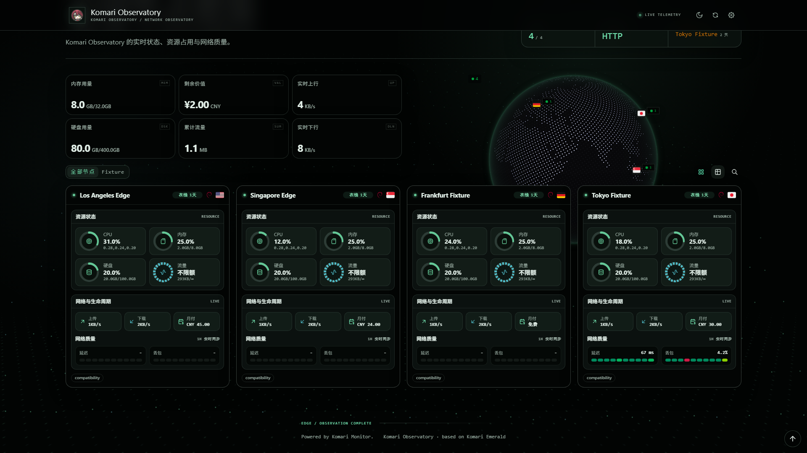

# LeoNetLab Observatory

A theme for Komari, based on Komari Emerald.



A cinematic global network observatory for Komari Monitor: a live dot-matrix data ocean, an instrument-grade interface, and a single continuous 3D globe from first visit to dashboard. Theme version numbers track Komari's own — future upgrades ship alongside Komari releases.

## Highlights

- **Cinematic first-visit animation** — a live dot-matrix globe rotates in on the cover, node markers focus from blur to clarity, then the whole dashboard rises into view in staged layers.
- **Seamless transition animations** — a single cobe engine travels from the intro cover to the dashboard via Vue Teleport; canvas, WebGL context, rotation phase and drag state never reset, plus a two-phase radial wipe on every theme switch.
- **Rich particle effects** — the DataOcean ambient canvas renders perspective point fields, sparse mesh lines, drifting currents and moving signal packets behind every page.
- **Heavily remixed color scheme** — a dark-green academic instrument palette with a calm light counterpart, built on oklch design tokens, hairline borders and serif display type.
- **Reworked Ping workspace** — selectable probe matrix, latest/loss/jitter metadata, a full-width timeline with data-relative axis, and ten-cell latency/loss rails on every node card.
- **Mobile performance engineering** — scroll-fixed background layers, static ambient frame on phones, capped globe DPR and frame rate, background-tab polling pause, and deferred chart animation.

## Install

**From GitHub Release (recommended)**

1. In Komari, open **Settings → Theme management**.
2. Add or update the theme from the repository: `https://github.com/LeonR-92/komari-theme-leonetlab`.
3. Komari resolves the latest GitHub Release and imports its first ZIP asset.

**Manual ZIP upload**

1. Download `komari-theme-leonetlab-build-v1.3.0.zip` from the [latest Release](https://github.com/LeonR-92/komari-theme-leonetlab/releases/latest).
2. Upload the ZIP in Komari theme management and select **LeoNetLab Observatory**.

## Configuration

All settings are optional managed theme settings; blank brand fields fall back to the Komari site configuration.

- Branding: display name, short name, logo URL, header subtitle, live-status label.
- Copy: home eyebrow/title/description, intro eyebrow/subtitle, footer eyebrow.
- Data: refresh interval, WebSocket/HTTP realtime transport.
- Home: default card/list view, default color mode, globe mode, visitor info card.

## Compatibility

- Node responses are normalized for both `1.2.5-fix1` arrays and `1.2.5-fix2`/`1.2.7` UUID-keyed objects.
- Ping charts prefer `public:queryMetrics` / `public:getPingMetricStats` when available and fall back to `common:getRecords` on method-not-found or uninitialized metric store errors.
- Theme configuration uses the managed settings type; Komari server 1.0.5 or newer is required.

## Development

```powershell
npm install
npm run lint
npm run type-check
npm run validate
npm run smoke:1.2.5
npm run build
```

The build emits `dist/` and `komari-theme-leonetlab-build-v1.3.0.zip` with a root `komari-theme.json` and `preview.png`.

## Tech Stack

| Category         | Technology                       |
| ---------------- | -------------------------------- |
| Framework        | Vue 3 + TypeScript               |
| Build tool       | Vite 7                           |
| UI components    | reka-ui (shadcn-vue style)       |
| Styling          | Tailwind CSS v4 + tw-animate-css |
| State management | Pinia 3                          |
| Router           | Vue Router 5                     |
| Charts           | ECharts 6 (vue-echarts)          |
| 3D globe         | cobe                             |
| Toasts           | vue-sonner                       |
| Icons            | @iconify/vue                     |
| Utilities        | @vueuse/core, dayjs              |
| Linting          | ESLint (@antfu/eslint-config)    |

## Acknowledgments & License

Based on [Komari Emerald](https://github.com/Tokinx/komari-theme-emerald) by Tokinx (MIT License) — special thanks for the original theme foundation.

- [Komari](https://github.com/komari-monitor/komari)
- [Komari Emerald](https://github.com/Tokinx/komari-theme-emerald)
- [Vue 3](https://vuejs.org/)
- [Vite](https://vitejs.dev/)
- [reka-ui](https://reka-ui.com/)
- [Tailwind CSS](https://tailwindcss.com/)
- [ECharts](https://echarts.apache.org/)
- [cobe](https://cobe.vercel.app/)

Released under the MIT License, © 2026 LeoNetLab ([LeonR-92](https://github.com/LeonR-92)).

`CHANGELOG.md` starts at v1.3.0 — theme versions now track Komari's own version numbers, and earlier releases were retired. Later changes are published in [GitHub Releases](https://github.com/LeonR-92/komari-theme-leonetlab/releases).
